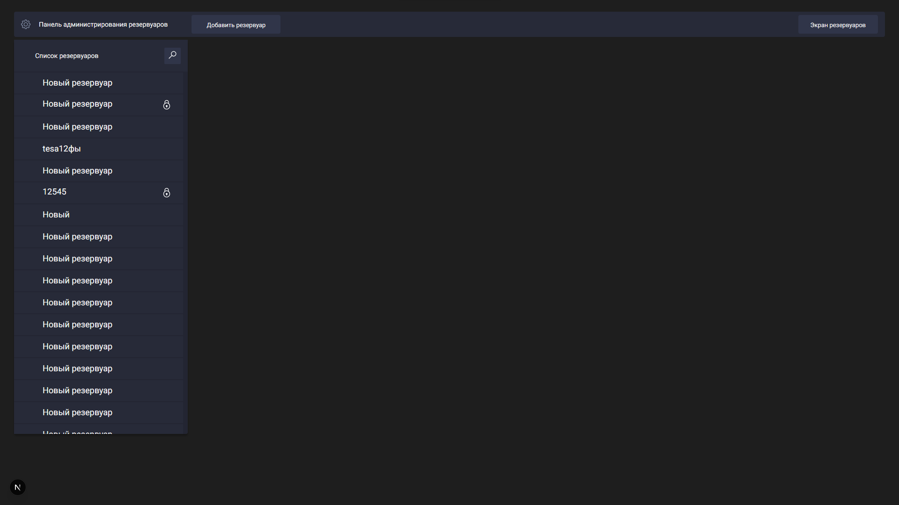
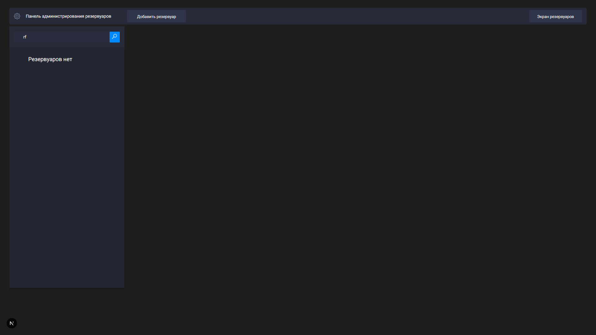
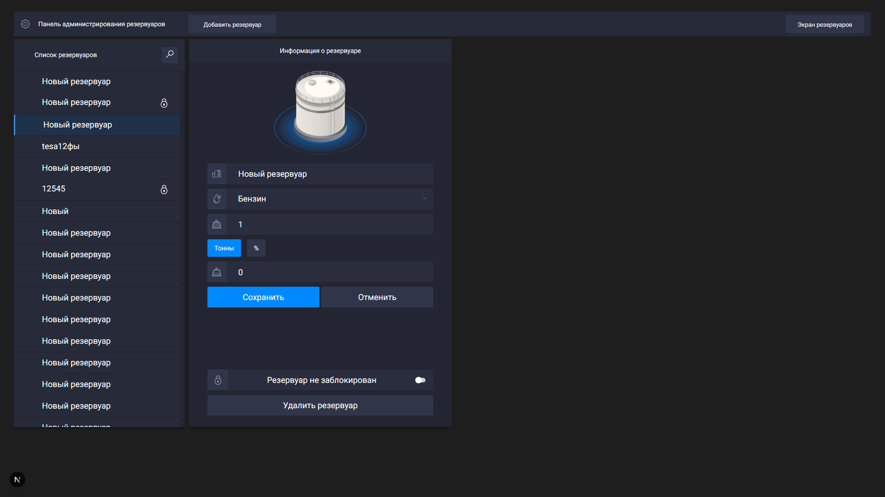
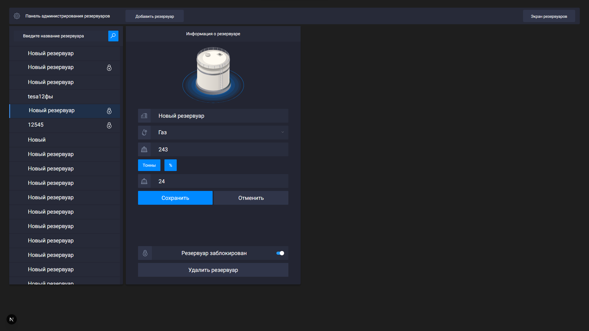
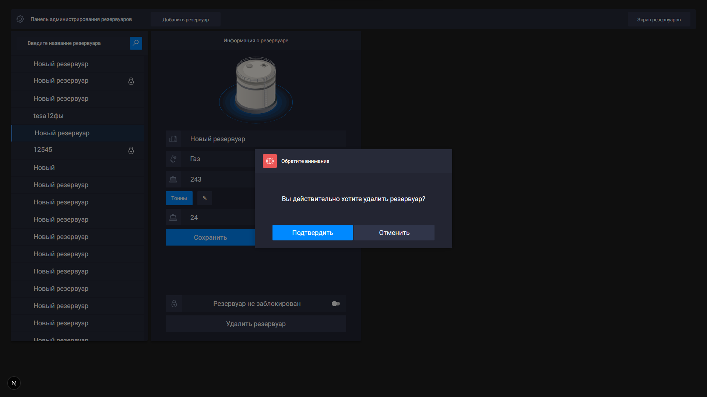

# 🛢️ next-frontend-reservoirs

Данный репозиторий содержит решение тестового задания для участия в летней практике **Студенческой IT-Лаборатории**.

## 🚀 Реализовано

- **🔄 Создание**, **редактирование** и **удаление** резервуаров
- **🔍 Поиск** резервуаров по названию
- **✅ Валидация** полей формы
- **🪟 Модальные окна** с подтверждением действий

## 📸 Скриншоты 












## ⚙️ Технологии

- **Frontend**: React + TypeScript, Next.js
- **Стили**: CSS Modules
- **State-менеджер**: Zustand
- **HTTP-клиент**: Axios
- **Линтинг**: ESLint + Prettier

## 🏃 Запуск

```bash
npm run dev
```

Приложение будет доступно по адресу: [http://localhost:3000](http://localhost:3000)
